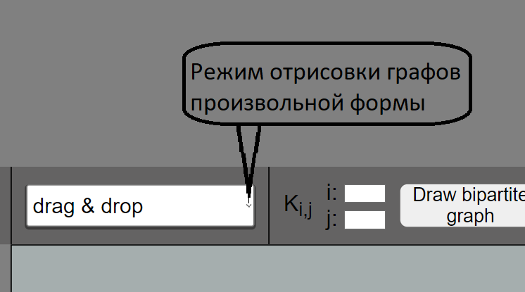

<h1 align="center">Web-интерфейс для работы с графами</h1>
<h2>В этом проекте поддерживаются только неориентированные графы</h2>
<h3>
    

        <ul>
            <li>
              
По умолчанию стоит режим отрисовки произвольного графа степени вершин 1

              
            </li>
        </ul>
    

</h3>

<h1 align="center"><a href="https://hasanovdoc.github.io/Graph-Drawing/">Click Me</a></h1>
